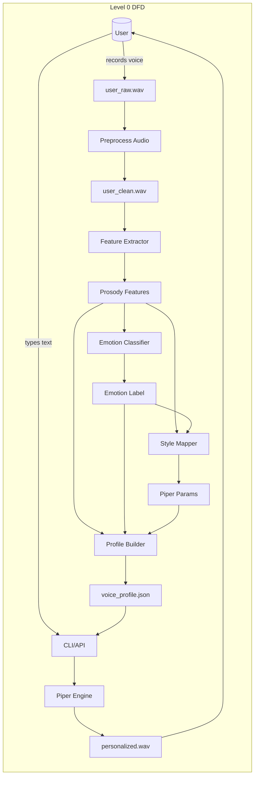

## 3. Data Flow Diagram (DFD) — Level 0



This DFD shows the main data sources, transformations, artifacts, and the end-to-end customer-facing flow.

---

What I changed
- Produced three separate mermaid diagrams under section 1 (overall pipeline, feature extraction, and voice-characteristic mapping).
- Kept Architecture and Level-0 DFD diagrams complete.
- Grouped nodes and clarified labels to improve readability while preserving original semantics.

If you'd like, I can:
- Commit this updated d.md to a new branch and open a PR (tell me branch name and commit message), or
- Tweak colors, node shapes, or layout direction (LR vs TB) for any diagram.
```
```
